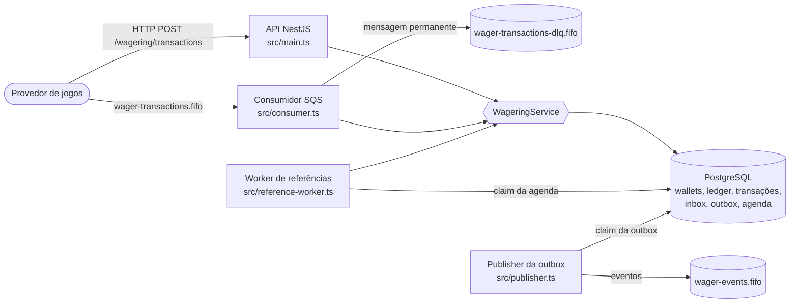

# Arquitetura

Decisões, trade-offs e limitações do Distributed Wagering Processor, descritos a partir do código deste repositório. Setup, comandos e contratos HTTP/fila estão no [README](README.md).

## Visão geral

Uma única base de código TypeScript gera quatro processos independentes, todos sobre o mesmo PostgreSQL. HTTP, fila e worker chamam o mesmo caso de uso financeiro (`WageringService`); não existe um segundo motor de regras.

| Processo | Entrada | Responsabilidade |
| --- | --- | --- |
| API (`src/main.ts`) | HTTP | Wallets, transações, consultas, ledger, reconciliação, health e métricas. |
| Consumidor (`src/consumer.ts`) | `wager-transactions.fifo` | Mesmo caso de uso da API, com inbox na mesma transação e ack depois do commit. |
| Publisher (`src/publisher.ts`) | Tabela `outbox_messages` | Entrega eventos confirmados a `wager-events.fifo`. |
| Worker (`src/reference-worker.ts`) | Tabela `pending_references` | Reavalia operações que chegaram antes da referência e as expira em 24h. |

Todos os processos podem rodar em várias instâncias: a coordenação acontece no banco (lock por wallet, unicidade, claims com lease), nunca em memória.

## Camadas

| Pasta | Conteúdo | Pode depender de |
| --- | --- | --- |
| `src/domain/` | `Money`, `Wallet`, `WagerTransaction`, `LedgerEntry`, eventos e códigos de falha. | Apenas o próprio domínio. |
| `src/application/` | `WageringService` e as portas (`FinancialUnitOfWork`, `FinancialSession`, `OutboxStore`, `PendingReferenceStore`, `Clock`...). | Domínio. |
| `src/infrastructure/postgres/` | EntitySchemas, mappers, unidade transacional, sessão, queries, claims e migrations. | Aplicação e domínio. |
| `src/infrastructure/sqs/`, `src/sqs/` | Cliente SQS, consumidor e publisher. | Aplicação. |
| `src/workers/` | Laço do worker de referências. | Aplicação. |
| `src/http/` | Controllers e filtro de erros (NestJS). | Aplicação. |
| `src/bootstrap.ts` | Composição, papel de banco e lifecycle. | Tudo acima. |
| `web/` | Painel React de testes manuais, que consome a API real. | Somente HTTP. |

O domínio não importa NestJS, MikroORM, SQL nem SDK da AWS. Classes de domínio têm factories (`submit`, `opening`, `open`) e `rehydrate`, que reconstrói o estado sem reexecutar transições. Os snapshots devolvidos (`toState`) são cópias.

NestJS cuida só da composição HTTP. A injeção usa tokens explícitos e não depende de decorator metadata emitida pelo Bun. Os demais processos montam suas dependências diretamente, sem contêiner.

## Dinheiro

`Money` guarda centavos em `bigint` e a moeda. Entrada e saída são strings decimais canônicas com exatamente duas casas (`"25.00"`): sem sinal, expoente, espaços ou zeros à esquerda. O máximo é `999999999999999999.99`. Como a aritmética do escopo é soma, subtração e comparação de centavos inteiros, não há arredondamento. Dinheiro nunca passa por `number`: o PostgreSQL usa `numeric(20,2)`, e o mapper (`ExactDecimalType`) lê e escreve strings e falha se receber número.

A moeda tem coluna própria. O modelo compara moedas, mas só BRL está habilitada. Moeda malformada é payload inválido (400); moeda válida não habilitada ou diferente da wallet é rejeição de negócio (`CURRENCY_NOT_SUPPORTED`, `CURRENCY_MISMATCH`).

Por kind: BET, WIN, REFUND e ROLLBACK exigem valor positivo; LOSS exige `0.00` (`AMOUNT_NOT_ALLOWED` caso contrário). O enunciado não define esses casos; a regra é uma interpretação.

## Wallet, ledger e transações

- Uma wallet por `(playerId, currency)`, garantida por UNIQUE. Saldo não negativo e limitado por CHECK. `version` começa em 1, inclusive com abertura positiva, e só cresce quando o saldo muda.
- Abertura positiva gera uma transação interna `OPENING`, que a API e a fila recusam, mais o crédito no ledger, na mesma transação SQL.
- O ledger é append-only: triggers rejeitam UPDATE, DELETE e TRUNCATE. Cada lançamento confere `balance_after = balance_before ± amount`, pertence a uma transação `PROCESSED` com o mesmo valor e a direção do kind. Há no máximo um lançamento por transação e wallet.
- Transações nascem `PENDING` e terminam `PROCESSED` ou `REJECTED`; podem passar por `PENDING_REFERENCE`. Terminais são imutáveis (trigger), e nenhuma volta a `PENDING`.
- LOSS registra resultado sem ledger, sem mudar saldo nem version.

A reconciliação (`POST /wallets/:id/reconciliation`) soma o ledger e compara com o saldo numa única transação `REPEATABLE READ`. Divergência é devolvida, logada e contada em métrica, nunca corrigida.

## Idempotência e replay

`wager_identities` reserva `(providerId, idempotencyKey)` e `(providerId, externalTransactionId)` com UNIQUE, via `INSERT ... ON CONFLICT DO NOTHING`. Assim a disputa é resolvida sem continuar numa transação abortada. A reserva não referencia a wallet, para não pegar um lock de chave estrangeira antes do lock exclusivo da wallet; o vínculo com a transação é uma chave estrangeira diferida.

| Comparação com registro existente | Resultado |
| --- | --- |
| Mesmo provedor, chave, ID externo e hash do payload | Replay: devolve o resultado persistido com `idempotentReplay: true`. |
| Mesma chave com outro payload | 409 `IDEMPOTENCY_CONFLICT`. |
| Mesmo ID externo com outra chave | 409 `EXTERNAL_ID_CONFLICT`. |

O hash é SHA-256 de JSON canônico (chaves ordenadas por unidade de código UTF-16) com todos os campos de negócio. A chave e os metadados de transporte ficam de fora, então HTTP e fila produzem o mesmo hash.

O resultado terminal fica em `transaction_results`, append-only, com o saldo observado no processamento. Movimentos posteriores não o alteram. O aceite pendente fica em `transaction_acceptances`. O replay devolve o terminal quando ele existe e, antes disso, o aceite com 202.

## Concorrência

Estratégia: lock pessimista da wallet (`SELECT ... FOR UPDATE`) em READ COMMITTED, dentro de uma unidade que grava reserva, saldo, ledger, resultado, vínculos, agenda, inbox e outbox antes de um único commit.

- Serializar por wallet torna a regra de saldo trivialmente correta: a decisão é tomada sobre o saldo relido sob lock. Wallets distintas seguem paralelas, sem lock global.
- O lock otimista foi descartado. Numa wallet disputada, como no cenário 80/80 ou em vinte débitos simultâneos, geraria retries em cascata e respostas 503 para operações que só precisavam esperar alguns milissegundos.
- Deadlock, serialization failure e lock timeout repetem a unidade até três vezes, com backoff curto e contexto ORM novo. Esgotadas as tentativas, a API responde 503 e a fila não confirma a mensagem. Disputa nunca vira rejeição financeira.
- Timeouts finitos: `lock_timeout` de 3s, `statement_timeout` de 10s e pool de 10 conexões por processo.

A prova usa três processos reais da API e uma barreira observada em `pg_stat_activity`, não `sleep`. Sem o `FOR UPDATE`, os cenários 80/80 e vinte débitos falham por lost update, o que mostra que a suíte detecta a ausência do lock.

## Referências e reversões

| Operação | Referência | Efeito |
| --- | --- | --- |
| WIN | Opcional; se informada, uma BET processada | Crédito. |
| REFUND | Obrigatória; BET processada, valor integral | Crédito. |
| ROLLBACK | Obrigatória; BET, WIN ou REFUND processada, valor integral | Direção inversa da referência. |

Referência a ser válida tem o mesmo provedor, jogador, wallet, moeda e rodada; `gameId` não é comparado. Referência rejeitada resulta em `REFERENCE_NOT_PROCESSED`; incompatível, em `REFERENCE_MISMATCH`; com outro valor, em `REFERENCE_AMOUNT_MISMATCH`; autorreferência, em `INVALID_REFERENCE`. Reverter WIN ou REFUND sem saldo é `REVERSAL_INSUFFICIENT_FUNDS`, código distinto do `INSUFFICIENT_FUNDS` da aposta.

A unicidade de reversão é por referência e tipo, num índice parcial em `wager_references`. Seguindo literalmente o enunciado, uma BET pode receber um REFUND e um ROLLBACK, ou seja, dois créditos. Essa é uma limitação conhecida desta interpretação; não há proteção de estorno líquido único.

## Referências fora de ordem

Ausente ou ainda pendente, a referência deixa a operação em `PENDING_REFERENCE`. O aceite, a agenda em `pending_references` (próxima tentativa em 1s, prazo de 24h) e o evento `WagerTransactionPendingReference` são gravados na mesma transação.

O worker reivindica pendências vencidas com um `UPDATE ... FOR UPDATE SKIP LOCKED` em autocommit, que grava token e lease de 30s. Depois, numa unidade financeira, trava a wallet e a agenda, nessa ordem, revalida o token e o status e aplica a mesma decisão do envio original.

| Na reavaliação | Resultado |
| --- | --- |
| Referência terminal | Processa ou rejeita conforme as regras acima. |
| Referência ainda ausente, dentro do prazo | Reagenda com backoff de 2s, 4s, 8s... até 5min, mais jitter, sem passar do prazo. Nenhum evento novo. |
| Referência ainda ausente, prazo vencido | `REJECTED` com `REFERENCE_EXPIRED` e evento. |

Toda operação que se torna terminal antecipa, na mesma transação, as pendências que a referenciam. Assim a dependente não espera o backoff, e cadeias como um ROLLBACK de um REFUND pendente se resolvem em sequência.

Travar a agenda numa transação aberta foi descartado: a ordem seria agenda e depois wallet, o inverso do envio que antecipa dependentes, com risco de deadlock. Crash antes do commit desfaz tudo e a lease devolve a pendência. Falha de infraestrutura nunca vira `FAILED`.

## Fila de comandos e inbox

O consumidor chama o mesmo `WageringService.submit` da API. A inbox `(consumer_name, message_id)` é gravada no início da mesma transação financeira; entregas simultâneas da mesma mensagem esperam na chave primária. A mensagem só é apagada (`DeleteMessage`) depois do commit. Um crash entre o commit e o ack resulta em reentrega reconhecida pela inbox, sem novo efeito.

| Erro | Tratamento |
| --- | --- |
| Envelope inválido, conflito de identidade ou de inbox, wallet inexistente | Enviado à DLQ com `failureReason`; o original só é apagado depois que a DLQ confirma. |
| Transitório ou inesperado | Sem ack; visibilidade com backoff de 2s a 60s; o redrive do broker leva à DLQ depois de 5 recebimentos. |

No SIGTERM, o consumidor interrompe o long polling, conclui a mensagem em andamento e devolve a visibilidade das demais. A unidade financeira leva milissegundos contra 30s de visibilidade, então a visibilidade não é renovada; se expirar, inbox e identidade evitam duplicidade.

## Eventos e outbox

Os eventos são classes concretas (`WagerTransactionProcessed`, `WagerTransactionRejected`, `WagerTransactionPendingReference`, `WalletBalanceChanged`) com `eventType` e `version` no tipo. O envelope carrega `MoneyProps` serializável. LOSS emite Processed, mas não BalanceChanged.

Os eventos são gravados em `outbox_messages` na mesma transação dos efeitos. O envelope é imutável; um evento publicado não pode ser reaberto.

O publisher reivindica até 10 eventos por `position` (ordem de gravação) com `SKIP LOCKED`, token e lease de 30s, em autocommit, e só então envia. Nenhum lock fica aberto durante o I/O de rede. O envio usa `SendMessageBatch` para `wager-events.fifo`, separado da fila de comandos, com `MessageGroupId` = wallet e `MessageDeduplicationId` = `eventId`. O timeout é de 10s, menor que a lease. `published_at` só é gravado se o token ainda for do publisher. Falha libera o claim e reagenda com backoff de 1s a 5min; o evento nunca é descartado.

A garantia é entrega ao menos uma vez com identidade estável, não exactly-once. Crash depois do envio e antes de `published_at`, ou timeout com resultado desconhecido, reenvia o mesmo `eventId`: o FIFO descarta a cópia em até 5 minutos e o consumidor deduplica pelo `eventId` depois disso. A ordem por wallet é de melhor esforço, porque um evento reagendado pode chegar depois de eventos mais novos; `walletVersion` permite ordenar.

## Banco de dados

- **Papéis:** o papel administrativo aplica migrations. O papel `jungle_runtime` não é dono do schema nem superusuário e tem `UPDATE` somente nas colunas mutáveis. Todo processo verifica o papel ao iniciar e recusa um papel privilegiado.
- **Migrations:** versionadas e reversíveis, em `src/infrastructure/postgres/migrations`, aplicadas por comando manual (`db:migrate`). Nunca há schema sync nem migration no bootstrap. `schema_version` é conferido pela readiness e pelos testes.
- **Proteções no banco:** UNIQUE de identidade, wallet, ledger e reversão; CHECK de valores, estados e coerência por kind. Triggers garantem a imutabilidade do ledger, dos resultados, das identidades, dos vínculos, dos aceites, das transações terminais, do envelope e da publicação da outbox, da inbox processada e da agenda resolvida. Também conferem a direção do ledger e a referência. Nenhuma cascata destrutiva.
- **Igualdade saldo = ledger:** é mantida pela unidade transacional e verificada pela reconciliação e pelos testes. Não há trigger que recalcule o histórico a cada escrita.

## Observabilidade

- **Logs:** JSON em stdout com `correlationId`, `messageId`, `transactionId`, `walletId` e `providerId` quando disponíveis. Sem payload financeiro, SQL, stack ou credenciais.
- **Health:** `/health/live` confirma o processo. `/health/ready` exige o schema na versão esperada e a fila de comandos alcançável, com timeout de 2s.
- **Métricas:** formato Prometheus em `/metrics` da API e de cada processo (consumidor 9101, publisher 9102, worker 9103, em loopback ou na rede interna do Compose). Os labels têm valores fixos; IDs ficam só nos logs.

| Métrica | Origem |
| --- | --- |
| `wagering_transactions_total{status}` | Resultados novos (HTTP, fila, worker); replays não contam. |
| `wagering_duplicates_total{source}` | Replays HTTP e redeliveries da fila. |
| `wagering_retries_total{origin}` | Retries de lock, fila, publisher e referência. |
| `wagering_dead_letters_total`, `sqs_dead_letter_queue_messages` | Envios à DLQ deste consumidor e profundidade da DLQ consultada no broker, que inclui o redrive. |
| `wagering_lock_conflicts_total` | Deadlocks, serialization failures e lock timeouts. |
| `outbox_pending_events`, `outbox_oldest_pending_age_seconds`, `outbox_publish_lag_seconds` | Backlog e idade lidos do banco pela API; latência até a publicação, medida no publisher. |
| `pending_references_open`, `pending_references_oldest_age_seconds`, `pending_references_overdue` | Backlog da agenda lido do banco pela API. |
| `wagering_unit_duration_seconds` | Histograma de duração da unidade financeira, com esperas de lock e retries. |
| `wagering_conflicts_total`, `wagering_infrastructure_failures_total`, `wagering_reconciliation_divergences_total` | Respostas 409 e 503 e divergências encontradas. |

Os contadores são por processo e zeram ao reiniciar, como de costume no Prometheus. Os gauges de backlog refletem o sistema inteiro.

## Autenticação

A autenticação de provedores não foi implementada. `ProviderIdentityPort` é chamado em todo envio e hoje aceita qualquer provedor (`UnauthenticatedProviderIdentity`). O desenho previsto é um IdP externo com client credentials por provedor: a porta valida o token e confere que o `providerId` do corpo pertence ao cliente autenticado. Não há tabela de senhas. A validação de jogador, wallet e referência acontece independentemente disso. Sem esse adaptador, a aplicação não deve ser exposta fora de ambiente controlado.

## Stack e escolhas

| Escolha | Motivo |
| --- | --- |
| Bun 1.4.2 | Runtime, gerenciador de pacotes e test runner exigidos; uma única versão em local, imagem e CI. |
| NestJS 11.2.6 | Composição e controllers HTTP; regras ficam fora do framework. |
| MikroORM 6.6.16 com EntitySchema | Unit of Work com `transactional()`, lock pessimista e migrations programáticas. EntitySchema mantém o domínio livre de decorators. TypeORM era a alternativa permitida. |
| PostgreSQL 17.6 | Fonte de verdade, com constraints, triggers, `SKIP LOCKED` e `numeric` exato. |
| MiniStack 1.5.15 | Emulador SQS sem conta nem token. O LocalStack passou a exigir token na versão 2026.03.0. FIFO, deduplicação, visibilidade, redrive e long polling foram verificados antes da adoção. |
| Zod 4 | Validação em runtime de HTTP, fila e ambiente. |

## Limitações conhecidas

- Uma BET pode receber um REFUND e um ROLLBACK (unicidade por referência e tipo, conforme o enunciado).
- Entrega de eventos ao menos uma vez, com ordem por wallet de melhor esforço.
- As leases da outbox e da agenda usam o relógio de cada processo; os hosts precisam de relógio sincronizado, com folga ampla frente aos 30s.
- Os eventos gerados pelo worker usam o ID da transação como `correlationId`, porque o da requisição original não é persistido.
- O processamento aceita só BRL; não há conversão cambial.
- Não há autenticação de provedores (veja acima) nem limitação de taxa.
- As métricas são locais a cada processo, sem OpenTelemetry nem dashboard; a agregação fica com o coletor.
- A emulação local de SQS é o MiniStack. Em AWS real a semântica é a mesma, mas a configuração de IAM e de endpoints não está incluída.
