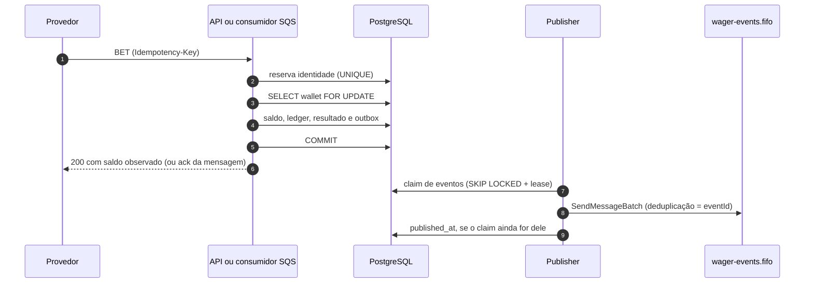

<div align="center">

# Distributed Wagering Processor

**Processador financeiro distribuído para apostas de iGaming.**<br>
Saldo, ledger e eventos corretos mesmo com mensagens duplicadas, fora de ordem, concorrência entre instâncias e falhas no meio do caminho.

[](https://github.com/BevilacquaJulio/distributed-wagering-processor/actions/workflows/ci.yml)
[](https://github.com/BevilacquaJulio/distributed-wagering-processor/actions/workflows/codeql.yml)
[](https://sonarcloud.io/summary/new_code?id=BevilacquaJulio_distributed-wagering-processor)
[](https://sonarcloud.io/summary/new_code?id=BevilacquaJulio_distributed-wagering-processor)


[Início rápido](#início-rápido) · [Usando o sistema](#usando-o-sistema) · [Postman](#pela-api-postman) · [API](#contrato-da-api) · [Testes](#testes) · [Arquitetura](ARCHITECTURE.md)

</div>

---

## Sumário

- [Visão geral](#visão-geral)
- [Como funciona](#como-funciona)
- [Início rápido](#início-rápido)
- [Execução detalhada](#execução-detalhada)
- [Endereços e portas](#endereços-e-portas)
- [Usando o sistema](#usando-o-sistema)
- [Contrato da API](#contrato-da-api)
- [Fila de comandos](#fila-de-comandos)
- [Referências fora de ordem](#referências-fora-de-ordem)
- [Eventos e outbox](#eventos-e-outbox)
- [Observabilidade](#observabilidade)
- [Testes](#testes)
- [Banco de dados](#banco-de-dados)
- [Scripts disponíveis](#scripts-disponíveis)
- [Estrutura do repositório](#estrutura-do-repositório)
- [CI](#ci)
- [Operação e atualização](#operação-e-atualização)
- [Limitações](#limitações)

---

## Visão geral

Provedores de jogos enviam apostas (`BET`) e resultados (`WIN`, `LOSS`, `REFUND`, `ROLLBACK`) por **HTTP** ou pela fila **SQS**. Cada operação movimenta a wallet do jogador e grava um lançamento num **ledger imutável** e eventos numa **outbox**, tudo na mesma transação.

A entrega é at-least-once, então o sistema assume que:

- a mesma operação pode chegar várias vezes;
- a operação dependente pode chegar antes da referenciada;
- várias instâncias podem tocar a mesma wallet ao mesmo tempo;
- o processo pode morrer antes ou depois do commit.

| Garantia | Como é obtida |
| --- | --- |
| Dinheiro exato | `bigint` em centavos no domínio, `numeric(20,2)` no banco e string `"25.00"` nos contratos. Nunca `number`. |
| Sem débito ou crédito duplicado | Idempotência persistente por provedor e chave, mais inbox para a fila, com UNIQUE no banco. |
| Saldo nunca negativo | Lock pessimista por wallet e CHECK no schema; provado com três processos simultâneos. |
| Ledger auditável | Append-only com triggers contra UPDATE, DELETE e TRUNCATE; a reconciliação compara saldo e ledger. |
| Nenhum evento confirmado perdido | Transactional outbox e publisher com claim, lease e reenvio com o mesmo `eventId`. |
| Funciona com várias instâncias | Toda coordenação acontece no PostgreSQL, nunca em memória. |

As decisões, os trade-offs e as limitações estão no **[ARCHITECTURE.md](ARCHITECTURE.md)**.

## Como funciona



Quatro processos saem da mesma base de código e usam o mesmo caso de uso financeiro:

| Processo | Comando | Papel |
| --- | --- | --- |
| API | `bun run dev` | HTTP, consultas, reconciliação, health, métricas e Swagger em `/docs`. |
| Consumidor | `bun run consumer` | Comandos da fila `wager-transactions.fifo`, com inbox, retry e DLQ. |
| Publisher | `bun run publisher` | Entrega da outbox à fila `wager-events.fifo`. |
| Worker de referências | `bun run reference-worker` | Reavalia operações que chegaram antes da referência e as expira em 24h. |

Há também um **painel React** de testes manuais, que consome a API real: em Docker no serviço `web` (porta 8080) ou no host com `bun run dev:web` (porta 5173).

---

## Início rápido

**Pré-requisitos:** [Bun 1.4.2](https://bun.com/docs/installation), Docker com Compose v2 e Git. O emulador SQS é o [MiniStack](https://ministack.org/), que não exige conta nem token.

Os comandos estão em PowerShell. No Linux ou no macOS, troque `Copy-Item` por `cp`; os demais são iguais.

```powershell
git clone https://github.com/BevilacquaJulio/distributed-wagering-processor.git
cd distributed-wagering-processor
Copy-Item .env.example .env
Copy-Item .env.test.example .env.test
bun install --frozen-lockfile

docker compose -f compose.yml up -d postgres sqs   # aguarde os dois ficarem healthy
bun run db:provision                               # cria o papel restrito jungle_runtime
bun run db:migrate                                 # aplica as migrations (manual, por decisão)
bun run sqs:provision                              # cria as filas de comandos, DLQ e eventos

docker compose -f compose.yml up -d --build api consumer publisher reference-worker web
```

Pronto:

| O quê | Onde |
| --- | --- |
| Painel de testes | http://127.0.0.1:8080 |
| Swagger da API | http://127.0.0.1:3000/docs |
| Readiness | http://127.0.0.1:3000/health/ready |

> [!NOTE]
> Migrations nunca rodam no startup, no healthcheck nem no `up` do Compose: são sempre um comando explícito com o papel administrativo. Por isso o Bun é necessário no host para os três comandos de preparação.

---

## Execução detalhada

<details>
<summary><b>Configuração (.env)</b></summary>

Copie `.env.example` para `.env` e `.env.test.example` para `.env.test`, só se ainda não existirem. Os valores de exemplo são credenciais fictícias de desenvolvimento. Mantenha as senhas consistentes entre `POSTGRES_PASSWORD`, `DATABASE_RUNTIME_PASSWORD` e as URLs; caracteres especiais em URL precisam de percent-encoding.

| Variável | Uso |
| --- | --- |
| `DATABASE_ADMIN_URL` | Papel administrativo: só `db:provision` e migrations. |
| `DATABASE_URL` | Papel `jungle_runtime` da aplicação: sem DDL nem privilégio de dono. |
| `DATABASE_URL_CONTAINER`, `SQS_ENDPOINT_CONTAINER` | Mesmos destinos vistos de dentro da rede do Compose. |
| `SQS_*` | Endpoint, região e nomes das filas (comandos, DLQ e eventos). |
| `API_DOCS_ENABLED` | `false` remove o Swagger (`/docs`). |
| `METRICS_HOST`, `METRICS_PORT` | Endpoint `/metrics` do consumidor, publisher e worker. |
| `VITE_*` | Públicas no navegador; nunca coloque segredo. |

`bun.lock` é o lockfile único e versionado. `--frozen-lockfile` falha se o manifesto divergir dele.

</details>

<details>
<summary><b>Banco e filas</b></summary>

```powershell
docker compose -f compose.yml config --quiet
docker compose -f compose.yml up -d postgres sqs
docker compose -f compose.yml ps
bun run db:provision
bun run db:status
bun run db:migrate
bun run db:status
bun run sqs:provision
```

- `db:provision` cria o papel restrito `jungle_runtime` uma única vez; se ele já existir, o comando falha sem trocar a senha.
- `db:status` deve terminar com `pending` vazio.
- `sqs:provision` cria `wager-transactions.fifo` (visibilidade de 30s, redrive para a DLQ após 5 recebimentos), `wager-transactions-dlq.fifo` e `wager-events.fifo` (as duas com retenção de 14 dias). É idempotente; `sqs:status` mostra os atributos.

</details>

<details>
<summary><b>Processos no host (desenvolvimento)</b></summary>

Um terminal para cada processo:

```powershell
bun run dev                # API em http://127.0.0.1:3000 (recarrega ao salvar)
bun run consumer
bun run publisher
bun run reference-worker
bun run dev:web            # painel em http://127.0.0.1:5173
```

O Vite encaminha `/api/*` para a API e remove só o prefixo `/api`. Não rode a API no host e no Docker ao mesmo tempo, porque as duas disputam a porta 3000.

</details>

<details>
<summary><b>Stack em Docker</b></summary>

```powershell
docker compose -f compose.yml up -d --build api consumer publisher reference-worker web
docker compose -f compose.yml ps
docker compose -f compose.yml logs -f --tail=100 api consumer publisher reference-worker web
docker compose -f compose.yml down            # preserva o volume do banco
```

- Uma única imagem (`Dockerfile`) roda os quatro processos: `dist/main.js`, `dist/consumer.js`, `dist/publisher.js` e `dist/reference-worker.js`. Ela instala dependências congeladas, roda como usuário `bun` e não aplica migrations.
- `stop_grace_period` de 30s deixa o SIGTERM concluir a mensagem, o lote ou a resolução em andamento.
- Publisher e worker escalam: `--scale publisher=2`, `--scale reference-worker=2`.
- O serviço `web` (`Dockerfile.web`) constrói o painel com Bun e o serve com nginx sem root. O nginx encaminha `/api/*` para a API pela rede interna, aplica CSP restrita e reavalia o DNS da API se o container dela for recriado.
- `/metrics` do consumidor, publisher e worker fica só na rede interna do Compose.

</details>

## Endereços e portas

Tudo é publicado só em `127.0.0.1`.

| Serviço | Endereço |
| --- | --- |
| Painel (Docker) | http://127.0.0.1:8080 |
| Painel (host, Vite) | http://127.0.0.1:5173 |
| API | http://127.0.0.1:3000 |
| Swagger UI | http://127.0.0.1:3000/docs |
| OpenAPI 3.1 | http://127.0.0.1:3000/docs/openapi.json (ou `.yaml`) |
| Métricas da API | http://127.0.0.1:3000/metrics |
| Métricas do consumidor, publisher e worker (host) | portas 9101, 9102 e 9103, em `/metrics` |
| PostgreSQL de desenvolvimento | `127.0.0.1:55432`, banco `jungle` |
| PostgreSQL de testes | `127.0.0.1:55433`, banco `jungle_test` |
| Emulador SQS (MiniStack) | http://127.0.0.1:4566 |

---

## Usando o sistema

### Pelo painel

Abra o painel (8080 em Docker ou 5173 no host). A tela é dividida em passos e abas, para que as informações fiquem à vista sem rolagem longa:

1. **Wallet:** crie uma wallet (gere um jogador e defina o saldo inicial) ou reabra uma das wallets recentes deste navegador. O saldo, a versão, o ID da wallet e o ID do jogador ficam numa barra fixa no topo, com botão de copiar.
2. **Operar:** escolha o tipo (BET, WIN, LOSS, REFUND ou ROLLBACK) e envie. O resultado aparece ao lado, com o **ID externo** pronto para copiar, e a lista "Enviadas nesta sessão" guarda cada envio.
3. **Consultar** e **Extrato:** abas para ler o estado gravado de uma transação, o ledger e a conferência entre saldo e ledger.
4. **Últimas requisições:** cada ação do painel (criar wallet, enviar, reenviar, consultar, conferir saldo) aparece com o método, a URL, os headers, o body, scripts opcionais de Pre-request e Post-response, a resposta recebida e um cURL para importar no Postman. A aba pisca até ser aberta sempre que uma nova requisição é registrada.

Cada campo e cada seção tem um botão **i**. Ele abre uma explicação com o que é o campo, o valor padrão, se pode ser alterado, as regras que o servidor aplica e os erros mais comuns. Comece pelo "Como funciona", no topo.

Para REFUND, ROLLBACK e WIN, o campo de referência sugere as operações compatíveis enviadas na sessão. Um clique preenche o ID externo e, nas reversões, também o valor e a rodada, que precisam ser iguais aos da operação referenciada. Se um ID interno for colado nesse campo, o painel avisa e oferece o ID externo correspondente.

Roteiro sugerido:

1. Crie uma wallet com `100.00`.
2. Envie uma BET de `25.00`: saldo `75.00`, versão 2.
3. **Reenviar a última**: o resultado vem marcado como replay, sem novo débito.
4. Envie uma BET acima do saldo: rejeição `INSUFFICIENT_FUNDS`, saldo intacto.
5. Troque para REFUND, clique na sugestão da primeira BET e envie: saldo `100.00`.
6. REFUND com ID externo referenciado `bet-futura-1` (digitado) e valor `10.00`: resposta 202, aguardando referência.
7. BET de `10.00` com ID externo `bet-futura-1`. Em **Enviadas nesta sessão**, clique em **Consultar** no REFUND: ele passa a processado em cerca de 1s, resolvido pelo worker.
8. Na aba **Extrato**, use **Conferir saldo**: diferença `0.00`.

### Pela API (Postman)

Para testar a API fora do painel, use o Postman. Crie uma collection e, na aba **Variables** dela, defina `base` = `http://127.0.0.1:3000`. Todo request que envia corpo usa **Body → raw → JSON**.

**1. Criar a wallet.** `POST {{base}}/wallets`

```json
{ "playerId": "{{$guid}}", "initialBalance": { "amount": "100.00", "currency": "BRL" } }
```

`{{$guid}}` faz o Postman gerar um UUID novo. A resposta 201 traz `id` (a wallet) e `playerId`: crie as variáveis `walletId` e `playerId` com esses valores.

**2. Enviar operações.** `POST {{base}}/wagering/transactions`, com o header `Idempotency-Key` e o corpo:

```json
{
  "providerId": "provider-a",
  "externalTransactionId": "bet-001",
  "playerId": "{{playerId}}",
  "walletId": "{{walletId}}",
  "roundId": "round-1",
  "gameId": "game-1",
  "kind": "BET",
  "money": { "amount": "25.00", "currency": "BRL" }
}
```

Envie em sequência, trocando só o que a tabela indica. Os IDs externos e as chaves precisam ser novos a cada execução do roteiro; troque o sufixo `001` se repetir.

| Passo | `Idempotency-Key` | Mudanças no corpo | Resposta esperada |
| --- | --- | --- | --- |
| BET | `key-bet-001` | nenhuma | 200 `PROCESSED`, saldo `75.00` |
| Mesma BET de novo | `key-bet-001` | nenhuma | 200, mesmo `transactionId`, `idempotentReplay: true`, sem novo débito |
| Mesma chave, outro valor | `key-bet-001` | `amount` `30.00` | 409 `IDEMPOTENCY_CONFLICT` |
| BET acima do saldo | `key-bet-002` | `externalTransactionId` `bet-002`, `amount` `500.00` | 422 `REJECTED`, `INSUFFICIENT_FUNDS` |
| REFUND da BET | `key-refund-001` | `externalTransactionId` `refund-001`, `kind` `REFUND`, `amount` `25.00`, mais `"referenceExternalTransactionId": "bet-001"` | 200 `PROCESSED`, saldo `100.00` |
| REFUND antes da BET | `key-refund-002` | `externalTransactionId` `refund-002`, `kind` `REFUND`, `amount` `10.00`, `"referenceExternalTransactionId": "bet-003"` | 202 `PENDING_REFERENCE`, saldo intacto |
| A BET referenciada chega | `key-bet-003` | `externalTransactionId` `bet-003`, `kind` `BET`, `amount` `10.00`, sem referência | 200 `PROCESSED`; o worker resolve o REFUND em cerca de 1s |

**3. Consultar.**

| Request | Para quê |
| --- | --- |
| `GET {{base}}/wallets/{{walletId}}` | Saldo e versão atuais (`100.00` ao fim do roteiro). |
| `GET {{base}}/wallets/{{walletId}}/ledger?limit=50` | Lançamentos, do mais antigo para o mais recente. |
| `GET {{base}}/providers/provider-a/wagering/transactions/refund-002` | Estado gravado do REFUND antecipado: `PROCESSED`, com `referenceTransactionId` preenchido. |
| `GET {{base}}/wagering/transactions/<transactionId>` | A mesma consulta pelo ID interno devolvido no envio. |
| `POST {{base}}/wallets/{{walletId}}/reconciliation` | `consistent: true` e diferença `0.00` entre saldo e ledger. |

Erros de formato respondem 400, com `{ "error": { "code", "message", "requestId" } }`. A referência é sempre o **ID externo** da outra operação, nunca o `transactionId` interno.

### Pela fila SQS

`sqs:send` monta o envelope do case (§10), valida com os mesmos schemas do consumidor e envia para a fila de comandos, com `MessageGroupId` igual à wallet:

```powershell
bun run sqs:send <walletId> <playerId> BET 25.00
bun run sqs:send <walletId> <playerId> REFUND 25.00 <idExternoDaBet>
```

A saída mostra o `messageId`, o `externalTransactionId` gerado e a `idempotencyKey`. Com o consumidor no ar, consulte o resultado em `GET /providers/provider-a/wagering/transactions/<externalTransactionId>`.

### Pelo Swagger

http://127.0.0.1:3000/docs lista todos os endpoints com schemas, exemplos e códigos de resposta, e permite enviar requisições pelo navegador (**Try it out**). Os schemas das requisições são gerados dos mesmos schemas Zod que validam a API, e um teste garante que toda rota está documentada e que as respostas reais correspondem ao documento.

---

## Contrato da API

| Método e caminho | Comportamento |
| --- | --- |
| `POST /wallets` | Cria wallet única por jogador e moeda; abertura positiva gera OPENING e ledger. |
| `GET /wallets/:walletId` | Saldo e versão atuais. |
| `POST /wagering/transactions` | BET, WIN, LOSS, REFUND e ROLLBACK, com header `Idempotency-Key` obrigatório. |
| `GET /wagering/transactions/:transactionId` | Estado atual, vínculo com a referência e resposta persistida (terminal ou aceite pendente). |
| `GET /providers/:providerId/wagering/transactions/:externalTransactionId` | Mesma consulta, pela identidade do provedor. |
| `GET /wallets/:walletId/ledger?limit=50&cursor=...` | Ordem crescente, cursor opaco, limite de 1 a 100. |
| `POST /wallets/:walletId/reconciliation` | Compara saldo e ledger em leitura consistente; não corrige divergência. |
| `GET /health/live`, `/health/ready` | Liveness; readiness com schema na versão esperada e fila de comandos alcançável. |
| `GET /metrics` | Métricas Prometheus, com backlog lido do banco. |
| `GET /docs`, `/docs/openapi.json`, `/docs/openapi.yaml` | Swagger UI e OpenAPI 3.1. |

**Formatos**
- **Money:** `{ "amount": "25.00", "currency": "BRL" }`, com exatamente duas casas, sem sinal, expoente, espaços ou zeros à esquerda. O máximo é `999999999999999999.99`, e só BRL está habilitada.
- **Identificadores:** provedor, ID externo, chave, rodada e jogo têm de 1 a 128 caracteres (`A-Z a-z 0-9 . _ : -`) e começam por letra ou número. Não há trim nem mudança de caixa. Jogador e wallet são UUID.
- **Referência:** `referenceExternalTransactionId` é obrigatório em REFUND e ROLLBACK, opcional em WIN e recusado em BET e LOSS. LOSS exige `0.00`; as demais operações exigem valor positivo.
- **Body:** JSON de até 16 KiB; campos desconhecidos são rejeitados. OPENING é interno e recusado.

| HTTP | Significado |
| --- | --- |
| 201 | Wallet criada. |
| 200 | Processada, consultada ou replay de resultado processado. |
| 202 | Aceita aguardando a referência (`PENDING_REFERENCE`); não é resultado final. |
| 400 | Payload ou header inválido (`INVALID_PAYLOAD`, `MISSING_IDEMPOTENCY_KEY`). |
| 404 | `WALLET_NOT_FOUND` ou `TRANSACTION_NOT_FOUND`. |
| 409 | `IDEMPOTENCY_CONFLICT`, `EXTERNAL_ID_CONFLICT` ou `WALLET_ALREADY_EXISTS`. |
| 422 | Rejeição de negócio persistida, com `failureCode` e saldo observado. |
| 503 | Indisponibilidade transitória; reenvie com a mesma chave. |

Erros de transporte seguem `{ "error": { "code", "message", "requestId" } }`, sem SQL, stack ou segredos.

<details>
<summary><b>Códigos de falha (<code>failureCode</code>)</b></summary>

| `failureCode` | Situação | O que o provedor pode fazer |
| --- | --- | --- |
| `INSUFFICIENT_FUNDS` | BET maior que o saldo. | Nova aposta exige nova identidade. |
| `REVERSAL_INSUFFICIENT_FUNDS` | ROLLBACK de WIN/REFUND sem saldo para desfazer o crédito. | Tratamento operacional; não é falta de saldo de aposta. |
| `AMOUNT_NOT_ALLOWED` | LOSS diferente de 0.00 ou demais operações com 0.00. | Corrigir o payload com nova identidade. |
| `BALANCE_LIMIT_EXCEEDED` | Crédito ultrapassaria 999999999999999999.99. | Corrigir o valor com nova identidade. |
| `CURRENCY_MISMATCH` / `CURRENCY_NOT_SUPPORTED` | Moeda diferente da wallet ou não habilitada. | Corrigir a moeda. |
| `WALLET_PLAYER_MISMATCH` | Jogador não é dono da wallet. | Corrigir jogador ou wallet. |
| `INVALID_REFERENCE` | A operação referencia o próprio ID externo. | Corrigir a referência. |
| `REFERENCE_NOT_PROCESSED` | A referência existe, mas foi rejeitada. | Desistir da reversão. |
| `REFERENCE_MISMATCH` | Tipo, jogador, wallet, moeda ou rodada incompatíveis. | Corrigir a referência. |
| `REFERENCE_AMOUNT_MISMATCH` | Valor da reversão diferente do original. | Enviar o valor integral. |
| `REFERENCE_ALREADY_REVERSED` | Já existe reversão processada do mesmo tipo. | Nada a fazer; o efeito já foi aplicado. |
| `REFERENCE_EXPIRED` | A referência não chegou em 24h desde o aceite. | Reenviar a operação original, se ainda for devida. |

</details>

---

## Fila de comandos

Envelope (§10 do case): `messageId`, `type: "WagerTransactionRequested"`, `occurredAt` em ISO-8601 e `data` com os campos do POST de transação mais `idempotencyKey`. O consumidor usa o mesmo caso de uso da API, com a inbox `(consumerName, messageId)` na mesma transação SQL. Recomenda-se `MessageGroupId` por wallet; a deduplicação do broker é otimização, não garantia.

| Situação | Tratamento |
| --- | --- |
| Processada, rejeitada por regra de negócio ou `PENDING_REFERENCE` | Commit e depois ack (`DeleteMessage`). |
| Mesmo `messageId` e conteúdo, ou operação já feita por HTTP | Replay do resultado persistido e ack, sem novo efeito. |
| JSON inválido, envelope fora do contrato, OPENING ou kind desconhecido | DLQ com `failureReason = INVALID_ENVELOPE`. |
| Mesmo `messageId` com outro conteúdo | DLQ com `INBOX_CONFLICT`; o primeiro efeito é preservado. |
| Conflito de chave ou ID externo; wallet inexistente | DLQ com o código correspondente. |
| Falha transitória | Sem ack; visibilidade com backoff de 2s a 60s; após 5 recebimentos, o redrive do broker leva à DLQ. |

O original de uma mensagem permanente só é apagado depois que a DLQ confirma o envio. Um crash entre o commit e o ack é resolvido pela inbox na reentrega. No SIGTERM, o consumidor conclui a mensagem em andamento e devolve a visibilidade das demais.

## Referências fora de ordem

WIN, REFUND ou ROLLBACK cuja referência ainda não existe são aceitos com **202 `PENDING_REFERENCE`**. O aceite, a agenda e o evento `WagerTransactionPendingReference` são duráveis. O worker reavalia sob o lock da wallet:

| Na reavaliação | Resultado |
| --- | --- |
| Referência processada e compatível | `PROCESSED`, com saldo, ledger, resultado e eventos na mesma transação. |
| Referência rejeitada ou incompatível | `REJECTED` com o `failureCode` da regra. |
| Ainda ausente, dentro do prazo | Reagenda com espera de 2s, 4s, 8s... até 5min, sem evento novo. |
| Ainda ausente após 24h | `REJECTED` com `REFERENCE_EXPIRED` e evento. |

Quando uma operação fica terminal, as pendências que a referenciam são antecipadas na mesma transação; cadeias, como um ROLLBACK de um REFUND pendente, se resolvem em sequência. Workers paralelos se coordenam por claim com `SKIP LOCKED`, token e lease de 30s.

## Eventos e outbox

Eventos (`WagerTransactionProcessed`, `WagerTransactionRejected`, `WagerTransactionPendingReference` e `WalletBalanceChanged`, este só quando o saldo muda) são gravados em `outbox_messages` no mesmo commit da operação. O publisher envia a `wager-events.fifo` com `MessageGroupId` igual à wallet e `MessageDeduplicationId` igual ao `eventId`.

| Falha | Resultado |
| --- | --- |
| Crash depois do claim e antes do envio | A lease vence e outro publisher entrega. |
| Crash depois do envio e antes de `published_at` | Reenvio com o mesmo `eventId`: o FIFO descarta a cópia em até 5 minutos e o consumidor deduplica depois disso. |
| Publisher pausado além da lease | Outro assume; o antigo não consegue confirmar. |
| Falha de envio | Backoff de 1s a 5min; o evento nunca é descartado. |

Garantia: entrega ao menos uma vez com identidade estável. Não há exactly-once entre PostgreSQL e SQS.

---

## Observabilidade

- **Logs:** JSON com `correlationId`, `messageId`, `transactionId`, `walletId` e `providerId`, sem payload financeiro, SQL ou segredos. Envie `X-Correlation-Id` para propagar o seu.
- **Health:** `/health/live` confirma o processo; `/health/ready` exige o schema na versão esperada e a fila de comandos alcançável.
- **Métricas:** formato Prometheus, com rótulos de valores fixos.

| Métrica | O que mede |
| --- | --- |
| `wagering_transactions_total{status}` | Resultados novos; replays não contam. |
| `wagering_duplicates_total{source}` | Replays HTTP e redeliveries da fila. |
| `wagering_retries_total{origin}` | Retries de lock, fila, publisher e referência. |
| `wagering_dead_letters_total`, `sqs_dead_letter_queue_messages` | Envios à DLQ e profundidade consultada no broker. |
| `wagering_lock_conflicts_total` | Deadlocks, serialization failures e lock timeouts. |
| `outbox_pending_events`, `outbox_oldest_pending_age_seconds`, `outbox_publish_lag_seconds` | Backlog, outbox lag e latência até a publicação. |
| `pending_references_open`, `..._oldest_age_seconds`, `..._overdue` | Backlog de referências pendentes. |
| `wagering_unit_duration_seconds` | Histograma da latência de processamento. |

---

## Testes

Os testes de integração e concorrência usam **PostgreSQL e MiniStack reais**, num banco separado e descartável (`jungle_test`, porta 55433, em memória). Eles recusam rodar contra outro banco e nunca aplicam migrations sozinhos.

```powershell
bun run typecheck
bun run typecheck:web
bun run lint
bun run test:unit

docker compose -f compose.yml --profile test up -d postgres-test sqs
bun --env-file=.env.test run db:provision
bun --env-file=.env.test run db:migrate
bun --env-file=.env.test run sqs:provision
bun run test:integration
bun run test:concurrency
```

> [!TIP]
> O `postgres-test` guarda dados em memória: ao recriar o container, refaça os três comandos de preparação com `--env-file=.env.test`.

`test:concurrency` sobe **três processos independentes da API** e sincroniza a disputa por uma barreira no próprio PostgreSQL (`pg_stat_activity`), sem `sleep`:

| Cenário | Resultado exigido |
| --- | --- |
| Mesma BET 50 vezes em paralelo | Uma transação e um débito; 49 replays com o mesmo resultado. |
| Duas BETs de 80.00 contra 100.00 | Uma `PROCESSED`, uma `INSUFFICIENT_FUNDS`; saldo final 20.00. |
| Vinte BETs de 10.00 contra 100.00 | Dez processadas com saldos observados de 90.00 a 0.00, dez rejeitadas. |
| Wallet bloqueada e outra wallet | A segunda é processada enquanto a primeira continua bloqueada. |
| Trinta criações da mesma wallet | Uma 201 e 29 respostas 409; uma única wallet no banco. |
| Dois REFUNDs da mesma BET | Um processado e outro `REFERENCE_ALREADY_REVERSED`. |

Sem o `FOR UPDATE` na wallet, os cenários 80/80 e vinte débitos falham por lost update, o que mostra que a suíte detecta a ausência do lock.

<details>
<summary><b>Onde cada cenário obrigatório do case é provado</b></summary>

Todos conferem, ao fim, que o saldo armazenado é igual ao reconstruído pelo ledger.

| Cenário | Prova |
| --- | --- |
| Mesma aposta 50 vezes → um débito; disputa de saldo; wallets distintas; três instâncias | `tests/concurrency/` |
| Worker morto depois do commit e antes do ack | `tests/integration/sqs-consumer.test.ts` (processo real com SIGKILL) |
| Dois publishers sobre a mesma outbox; crash antes e depois do envio | `tests/integration/outbox-publisher.test.ts` |
| REFUND/ROLLBACK antes da referência; expiração; dois workers | `tests/integration/operations.test.ts`, `tests/integration/reference-worker.test.ts` |
| Reinício com consistência final | Crash em consumidor, publisher e worker; SIGTERM dos processos reais (CI Linux) |
| Migrations, constraints e atomicidade | `tests/integration/financial-flow.test.ts`, `operations.test.ts`; up/down/up na CI |
| Inbox, redelivery, retry e DLQ | `tests/integration/sqs-consumer.test.ts` |
| Money, Wallet, regras por kind, moeda e payload divergente | `tests/unit/`, `tests/integration/financial-flow.test.ts` |
| Divergência de saldo sinalizada; métricas | `tests/integration/observability.test.ts` |
| Documentação conforme a API real | `tests/integration/api-docs.test.ts` |

</details>

---

## Banco de dados

| | Desenvolvimento | Testes |
| --- | --- | --- |
| Serviço | `postgres` | `postgres-test` (`--profile test`) |
| Endereço | `127.0.0.1:55432/jungle` | `127.0.0.1:55433/jungle_test` |
| Dados | Volume persistente | Memória; somem ao recriar |
| Usado por | API, painel e processos (`.env`) | Suítes automáticas (`.env.test`) |

Para inspecionar com um cliente como DBeaver: host `127.0.0.1`, a porta e o banco da tabela, usuário e senha de `POSTGRES_USER` e `POSTGRES_PASSWORD` do seu `.env`. Prefira uma conexão somente leitura. O papel `jungle_runtime` (senha `DATABASE_RUNTIME_PASSWORD`) enxerga o mesmo que a aplicação e não consegue alterar o histórico.

Tabelas principais: `wallets`, `wallet_ledger`, `wager_transactions`, `transaction_results`, `outbox_messages`, `inbox_messages` e `pending_references`.

## Scripts disponíveis

| Script | O que faz |
| --- | --- |
| `dev`, `start`, `start:built` | API com recarga, sem recarga, ou a partir de `dist/`. |
| `consumer`, `publisher`, `reference-worker` | Demais processos. |
| `dev:web`, `build:web` | Painel em desenvolvimento ou build estático em `dist/web`. |
| `build` | Os quatro processos em `dist/`. |
| `typecheck`, `typecheck:web`, `lint` | Tipos da API e do painel; Biome. |
| `test:unit`, `test:integration`, `test:concurrency` | Suítes de teste. |
| `db:provision`, `db:status`, `db:migrate`, `db:down` | Papel restrito e migrations (`db:down` só aceita `jungle_test` com `ALLOW_DISPOSABLE_DOWN=yes`). |
| `sqs:provision`, `sqs:status`, `sqs:send` | Criar e inspecionar filas; enviar um comando de teste. |

## Estrutura do repositório

```text
src/
  domain/           Money, Wallet, WagerTransaction, LedgerEntry, eventos (sem framework)
  application/      WageringService e portas
  infrastructure/   PostgreSQL (MikroORM, migrations, claims), SQS, métricas
  http/             controllers, filtro de erros, OpenAPI
  sqs/              consumidor e publisher
  workers/          worker de referências
  main.ts, consumer.ts, publisher.ts, reference-worker.ts   pontos de entrada
web/                painel React + nginx do container
scripts/            provisionamento, migrations e filas (manuais)
tests/              unit/, integration/, concurrency/, support/
```

## CI

O workflow `CI` roda em todo PR para `teste` e `main`:

| Job | O que executa |
| --- | --- |
| Lint, tipos, unidade e build | Instalação congelada, typecheck (API e painel), lint, unidade com cobertura e builds. |
| Auditoria de dependências | `bun audit --audit-level=high`. |
| Imagem Docker e Compose | Valida o `compose.yml`, constrói as imagens da API e do painel e roda `nginx -t`. |
| Integração com PostgreSQL real | Banco e emulador descartáveis com credenciais geradas na hora, migrations, integração e concorrência, e migration down/up/up. |
| SonarCloud Quality Gate | Cobertura de unidade e integração; 80% no código novo. |

O `CodeQL` analisa TypeScript em PRs e nas branches `teste` e `main`. A auditoria tem uma exceção documentada: `braces` (GHSA-vfj7-8cjw-p6xm) não tem versão corrigida e é alcançada só por globs estáticos do MikroORM. Não há deploy.

## Operação e atualização

| Mudança | O que fazer |
| --- | --- |
| Código da API ou dos processos | `docker compose -f compose.yml up -d --build api consumer publisher reference-worker` |
| Código do painel | `docker compose -f compose.yml up -d --build web` (ou `bun run dev:web` no host) |
| Schema | `bun run db:status`, `bun run db:migrate`, `bun run db:status` e depois atualize a API. Nunca migre no startup. |
| Variável de ambiente de container | `docker compose -f compose.yml up -d --force-recreate api`; `restart` não recarrega env. |
| Dependências | Atualize o manifesto, revise o `bun.lock` e reconstrua as imagens. |

## Limitações

- Não há autenticação de provedores. `ProviderIdentityPort` é o ponto de extensão, com o desenho de IdP descrito no ARCHITECTURE.md; não exponha a aplicação fora de ambiente controlado.
- Uma BET pode receber um REFUND e um ROLLBACK (unicidade por referência e tipo, como no enunciado).
- Entrega de eventos ao menos uma vez, com ordem por wallet de melhor esforço.
- Só BRL; sem conversão cambial nem limitação de taxa.
- Sem teste de carga (`test:load`) nem dashboard; as métricas ficam prontas para um coletor Prometheus.

Detalhes e justificativas: **[ARCHITECTURE.md](ARCHITECTURE.md)**.
